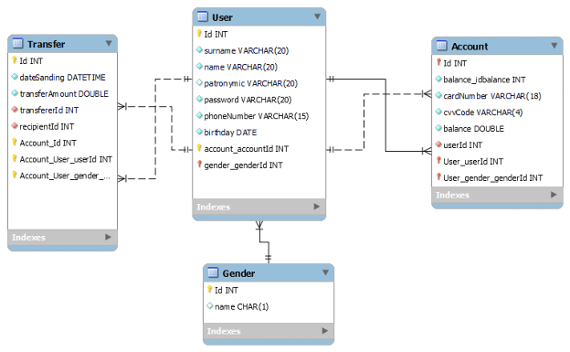

# Предметная область

Банк — это финансовая организация, предоставляющая услуги по хранению, управлению и перемещению денежных средств. Основные направления деятельности включают:

1.Депозиты и счета: Открытие/закрытие счетов (текущих, сберегательных), начисление процентов.

2.Кредитование: Выдача кредитов (потребительских, ипотечных, автокредитов), оценка заёмщиков.

3.Платежи и переводы: Внутренние и международные переводы, оплата услуг (ЖКХ, налоги).

4.Инвестиции: Управление капиталом, брокерские услуги.

5.Цифровые сервисы: Мобильный/онлайн-банкинг, автоматизация процессов (чат-боты, уведомления).

6.Безопасность: Защита данных, двухфакторная аутентификация, мониторинг мошенничества.

# User Stories

Для клиентов:
1.Открытие счета

Как новый клиент, я хочу открыть текущий счет онлайн, чтобы не посещать отделение банка.

Критерии принятия: Заполнение анкеты, удалённая идентификация, мгновенное создание счета.

2.Перевод средств

Как пользователь, я хочу переводить деньги на счёт другого человека по номеру телефона, чтобы упростить процесс.

Критерии: Поддержка перевода через приложение, мгновенное зачисление, уведомление получателя.

3.Оформление кредита

Как заёмщик, я хочу подать заявку на потребительский кредит и получить предварительное решение за 5 минут, чтобы сэкономить время.

Критерии: Интеграция с кредитным бюро, автоматический скоринг, онлайн-подписание договора.

# ERD-диаграмма


# my-vue-app

## Project setup
```
npm install
```

### Compiles and hot-reloads for development
```
npm run serve
```

### Compiles and minifies for production
```
npm run build
```

### Lints and fixes files
```
npm run lint
```

### Customize configuration
See [Configuration Reference](https://cli.vuejs.org/config/).
